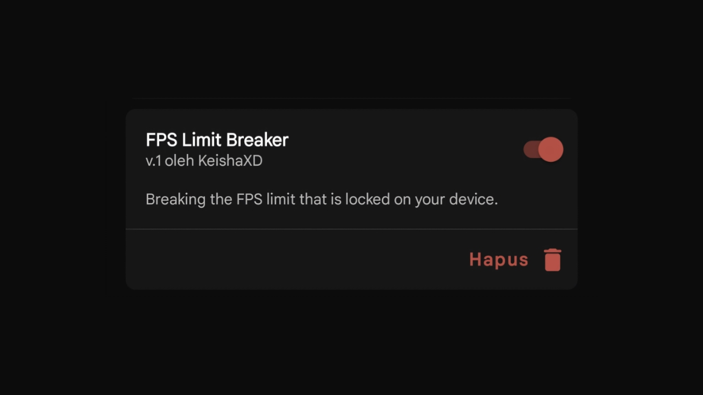

# FPS Limit Breaker

This module is made to remove the FPS limit that is usually locked by a device’s system. Many phones restrict frame rates (60 FPS) to save battery, reduce heat, or protect the hardware. However, this also limits the performance, especially in games. By using this module, users can unlock higher FPS like 90, 120, or even unlimited FPS—depending on the display and GPU support.

## Warning :

This module may cause:
1. Overheating
2. Battery drain
3. Device not turning on (dead device)
4. Hardware damage (if your device can't handle it)

##Notes :
Do not force your device if you think it can't handle it. I am not responsible for anything that happens to your device.

##Suggestion if your device can handle games at over 60 FPS:

Combine this module with a gaming module, and if necessary, add a thermal disable module (But if anything happens, I am not responsible).

## Download :
To download this module, please go to the [Release page](https://github.com/KeishaXD/FPS-Limit-Breaker/releases/latest)

## Disclaimer:
Use these modules at your own risk. I am not responsible for any potential damage to your device.